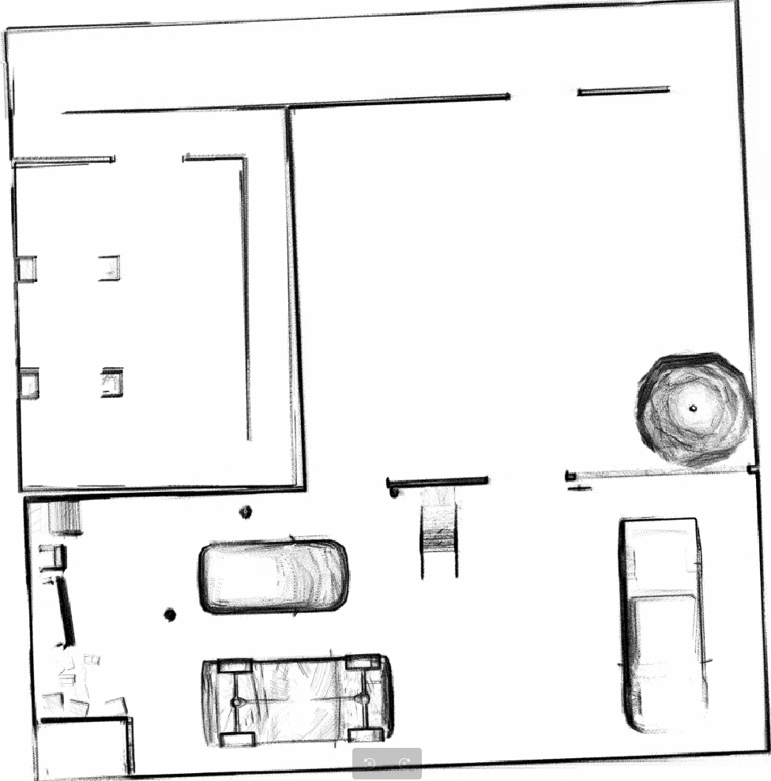

## 0. Dependencies

* System Requirements:
  * Ubuntu 20.04 (18.04 not yet tested)
  * ROS Noetic (Melodic not yet tested)
  * C++11 and above
  * CMake: 3.0.2 and above
* This repo depends on the following standard ROS pkgs:
  * `roscpp`
  * `rospy`
  * `rviz`
  * `std_msgs`
  * `nav_msgs`
  * `geometry_msgs`
  * `visualization_msgs`
  * `tf2`
  * `tf2_ros`
  * `tf2_geometry_msgs`
  * `pluginlib`
  * `map_server`
  * `gazebo_ros`
  * `jsk_rviz_plugins`
  * `jackal_gazebo`
  * `jackal_navigation`
  * `velodyne_simulator`
  * `teleop_twist_keyboard`
* And this [gazebo_model](https://github.com/osrf/gazebo_models) repositiory


## 1. Installation

### 1.1 Git clone from github repo

```shell
git clone https://github.com/niudix/ME5413_Final_Project.git
```

Change to your directior

```shell
cd /YOUR_PATH/ME5413_Final_Project/src
```

### 1.2 rebuild the repo

1. Delete ws_livox and Livox-SDK

   ```shel
   rm -rf Livox-SDK
   rm -rf ws_livox 
   ```

2. install Livox-SDK

    ```shell
    git clone https://github.com/Livox-SDK/Livox-SDK.git
    cd Livox-SDK
    cd build && cmake ..
    make
    sudo make install
    ```

  3. install livox_ros_driver

     ```she
     git clone https://github.com/Livox-SDK/livox_ros_driver.git ws_livox/src
     cd ws_livox
     catkin_make
     ```

     **Fix 'cannot find ikd-tree' error**

     clone the ikd-tree repo

     ```she
     cd /YOUR_PATH/ME5413_Final_Project/src
     git clone https://github.com/hku-mars/ikd-Tree.git
     cd ikd-Tree/ikd-Tree/
     ```

     copy ikd_Tree.cpp and ikd_Tree.h to ME5413_Final_Project/src/FAST_LIO/include/ikd-Tree

     ```she
     cp ikd_Tree.cpp /YOUR_PATH/ME5413_Final_Project/src/FAST_LIO/include/ikd-Tree/
     cp ikd_Tree.h /YOUR_PATH/ME5413_Final_Project/src/FAST_LIO/include/ikd-Tree/
     ```

     ```she
     cd /YOUR_PATH/ME5413_Final_Project/src
     rm -rf ikd-Tree/
     ```

   4. build the repo

      ```she
      cd /YOUR_PATH/ME5413_Final_Project
      catkin_make
      ```

      

## 2. Usage

### 2.1. Mapping

Launch the gazebo with the project world

```she
cd /YOUR_PATH/ME5413_Final_Project
source devel/setup.bash
roslaunch me5413_world world.launch
```

In another terminal, launch Fast-Lio for mapping 

```shel
cd /YOUR_PATH/ME5413_Final_Project
source source devel/setup.bash
roslaunch me5413_world FL_mapping.launch 
```

You can use the controller to move the robot


You can also see the point cloud in rviz


You can visualise the raw point cloud image in the Fast Lio folder.

```shell
cd /YOUR_PATH/ME5413_Final_Project/src/FAST_LIO/PCD
pcl_viewer scans.pcd
```


### 2.2 Convert point cloud to grid map

```shell
roslaunch pcd2pgm run.launch
```

In another terminal 

```she
cd /YOUR_PATH/ME5413_Final_Project/src/pcdtomap/map/
rosrun map_server map_saver
```




### 2.3 evo Evaluation

You can record your own rosbag 

```shell
cd /YOUR_PATH/ME5413_Final_Project/src/EVO
rosbag record -a
```

Using evo to evaluate your own bag

```shel
evo_ape bag YOUR_BAG_NAME.bag /gazebo/ground_truth/state /Odometry -r full --plot --plot_mode xy
```

**notice: Do not forget to change YOUR_BAG_NAME to your own.**

You can also use our bag

```shell
cd /YOUR_PATH/ME5413_Final_Project/src/EVO
evo_ape bag EVO_evalue_2024-04-07-15-08-23.bag /gazebo/ground_truth/state /Odometry -r full --plot --plot_mode xy
```


## 3. Navigation

### 3.1 launch navigation node

```shell
cd /YOUR_PATH/ME5413_Final_Project/src
source devel/setup.bash
roslaunch me5413_world world.launch
```

In another Terminal 

```shell
cd /YOUR_PATH/ME5413_Final_Project/src
source devel/setup.bash
roslaunch me5413_world navigation.launch
```

Howere if you meet any navigation failed problem. You can just download the [navigation part](https://github.com/YUJ0E/Autonomous_Mobile_Robotics_Navigation) which works fine.


